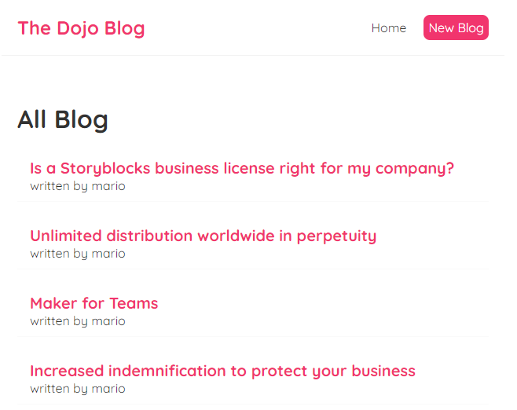
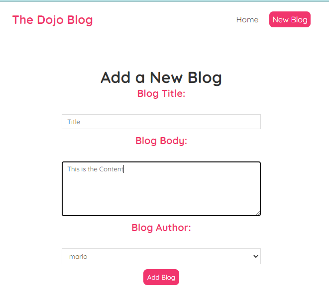
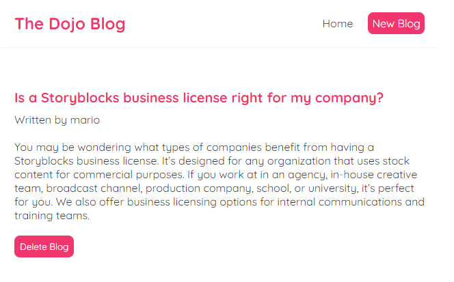

# React-Blog-App

## Steps to run the application on loaclsystem

### Install all the required packages

Run the below command to install all the required packages required to run React-Blog-App

#### `npm install`

### Run the Db server which is used to store the data

Here we used simple json server to store all the blog details

#### `npm run json-server`

### Run the Application

Run the below command in other terminal Keeping the json-server running in background

#### `npm start`

## Images

#### Home Page

#### Create Page

#### Details Page

